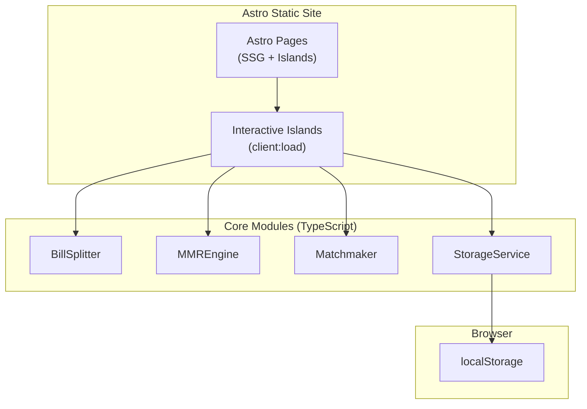
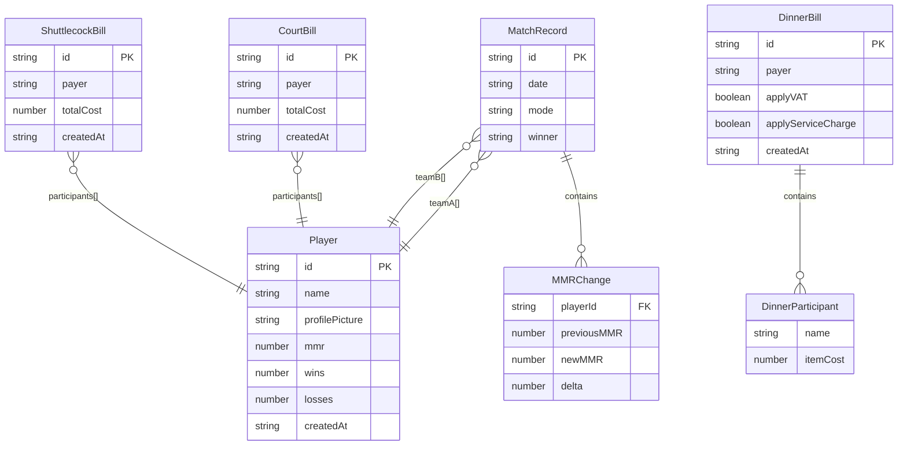

# Design Document: RTT Badminton Club Manager

## Overview

RTT Badminton is a client-side Astro 5.x static site deployed to GitHub Pages for managing a badminton club's activities. The app covers three core domains:

1. **Bill Splitting** — Court fees, shuttlecock costs, and dinner bills with optional VAT/service charge
2. **MMR & Matchmaking** — ELO-style rating system, match recording, balanced team generation, and a leaderboard
3. **Player Profiles** — BWF-inspired player pages with photos, stats, and match history

All data is persisted in `localStorage`. There is no backend — the entire app runs in the browser as a static site.

### Key Design Decisions

- **Astro 5.x with Islands Architecture**: Pages are server-rendered at build time. Interactive components (forms, matchmaker, bill calculator) use Astro's client-side islands with `client:load` directives. We use vanilla TypeScript + Astro components (no React/Vue/Svelte dependency) to keep the bundle minimal.
- **localStorage for persistence**: A single `StorageService` module handles all reads/writes to `localStorage`, serializing data as JSON. This keeps the architecture simple and avoids any backend dependency.
- **Static deployment**: The site is built with `astro build` and deployed to GitHub Pages via GitHub Actions. All routes are pre-rendered at build time; dynamic content is hydrated client-side from `localStorage`.
- **BWF-inspired player profiles**: The player list and profile pages follow the visual structure of [bwfbadminton.com/players](https://bwfbadminton.com/players/) — card grid for the list, hero banner + stats + match history for individual profiles.

## Architecture



### Page Structure

```
/                     → Home / Dashboard
/players/             → Player list (card grid, BWF-style)
/players/[id]/        → Player profile (BWF-style hero + stats + history)
/ranking/             → Leaderboard
/matches/             → Match recording form
/matchmaking/         → Matchmaker tool
/bills/               → Bill splitting (court, shuttlecock, dinner tabs)
```

### Module Responsibilities

| Module | Responsibility |
|---|---|
| `BillSplitter` | Validates inputs, calculates equal splits (court/shuttlecock) and itemized splits (dinner with VAT/SC) |
| `MMREngine` | Computes expected scores, MMR deltas using ELO formula (K=32), handles singles and doubles |
| `Matchmaker` | Generates balanced team assignments from available players, minimizes MMR difference |
| `StorageService` | Serializes/deserializes all data to/from `localStorage`, handles corruption gracefully |

## Components and Interfaces

### BillSplitter Module

```typescript
// Types
type BillType = 'court' | 'shuttlecock' | 'dinner';

interface CourtBill {
  id: string;
  type: 'court';
  payer: string;
  totalCost: number;
  participants: string[];
  createdAt: string;
}

interface ShuttlecockBill {
  id: string;
  type: 'shuttlecock';
  payer: string;
  totalCost: number;
  participants: string[];
  createdAt: string;
}

interface DinnerParticipant {
  name: string;
  itemCost: number;
}

interface DinnerBill {
  id: string;
  type: 'dinner';
  payer: string;
  participants: DinnerParticipant[];
  applyVAT: boolean;
  applyServiceCharge: boolean;
  createdAt: string;
}

type Bill = CourtBill | ShuttlecockBill | DinnerBill;

interface BillSplitResult {
  shares: { name: string; owes: number }[];
  totalPerPerson?: number; // For equal-split bills
  subtotal?: number;
  serviceChargeAmount?: number;
  vatAmount?: number;
  grandTotal?: number;
}

// Functions
function calculateCourtSplit(bill: CourtBill): BillSplitResult;
function calculateShuttlecockSplit(bill: ShuttlecockBill): BillSplitResult;
function calculateDinnerSplit(bill: DinnerBill): BillSplitResult;
function validateBill(bill: Bill): ValidationResult;
```

### MMREngine Module

```typescript
interface MMRChange {
  playerId: string;
  previousMMR: number;
  newMMR: number;
  delta: number;
}

// Functions
function calculateExpectedScore(playerMMR: number, opponentMMR: number): number;
function calculateMMRChange(playerMMR: number, opponentMMR: number, won: boolean, kFactor?: number): number;
function processMatch(match: MatchInput): MMRChange[];
function getInitialMMR(): number; // Returns 1000
```

**ELO Formula Details:**
- `Expected_Score = 1 / (1 + 10^((opponentMMR - playerMMR) / 400))`
- `MMR_Change = K * (actualScore - expectedScore)` where `actualScore` is 1 (win) or 0 (loss)
- `K_Factor = 32` for all players
- For doubles: team rating = average of both players' MMRs; both players on a team receive the same delta

### Matchmaker Module

```typescript
interface MatchAssignment {
  type: 'singles' | 'doubles';
  teamA: string[];
  teamB: string[];
  mmrDifference: number;
  teamAWinProbability: number;
  teamBWinProbability: number;
}

interface MatchmakingResult {
  matches: MatchAssignment[];
  sittingOut: string[];
}

// Functions
function generateMatchups(playerIds: string[]): MatchmakingResult;
function calculateWinProbability(teamAMMR: number, teamBMMR: number): number;
```

**Matchmaking Logic:**
- 2 players → 1 singles match
- 3 players → 1 singles match (best MMR balance) + 1 sitting out
- 4 players → 1 doubles match (minimize team MMR difference)
- 5+ players → multiple matches, minimize overall MMR difference, indicate sit-outs for odd counts

### StorageService Module

```typescript
interface AppData {
  players: Player[];
  matches: MatchRecord[];
  bills: Bill[];
}

// Functions
function loadData(): AppData;
function saveData(data: AppData): void;
function savePlayers(players: Player[]): void;
function saveMatches(matches: MatchRecord[]): void;
function saveBills(bills: Bill[]): void;
function isDataCorrupted(raw: string | null): boolean;
```

### Match Recording

```typescript
type GameMode = 'singles' | 'doubles';

interface MatchInput {
  mode: GameMode;
  teamA: string[];  // player IDs
  teamB: string[];  // player IDs
  winner: 'teamA' | 'teamB';
}

interface MatchRecord {
  id: string;
  date: string;
  mode: GameMode;
  teamA: string[];
  teamB: string[];
  winner: 'teamA' | 'teamB';
  mmrChanges: MMRChange[];
}
```

### Player Profile

```typescript
interface Player {
  id: string;
  name: string;
  profilePicture: string | null; // base64 data URL or null for default
  mmr: number;
  wins: number;
  losses: number;
  createdAt: string;
}
```


### UI Components (BWF-Inspired)

#### Player List Page (`/players/`)
Inspired by the BWF players list at bwfbadminton.com/players/:
- **Search bar** at the top for filtering players by name
- **Card grid layout** — each card contains:
  - Player profile photo (or default placeholder)
  - Player name (first name + LAST NAME in caps, e.g., "Viktor AXELSEN")
  - Current MMR badge
  - Win/Loss record
- Cards link to individual player profile pages

#### Player Profile Page (`/players/[id]/`)
Inspired by BWF individual player profiles:
- **Hero banner area** with a colored gradient background (badminton theme)
- **Profile photo** (large, circular/rounded) overlapping the banner
- **Player name** prominently displayed (first name + LAST NAME in caps)
- **Key stats row**: Current MMR, Rank position, Win/Loss record
- **Match History section**: List of recent matches in reverse chronological order, showing:
  - Date
  - Game mode (Singles/Doubles)
  - Opponent(s)
  - Result (Win/Loss)
  - MMR change (+/- delta)
- **Default placeholder image** when no profile picture is uploaded

#### Ranking Page (`/ranking/`)
- Table/list layout with rank position, profile thumbnail, player name, MMR, wins, losses
- Sorted by MMR descending, with tiebreakers (wins, then alphabetical)
- Top 3 players highlighted visually (gold/silver/bronze accents)

#### Bills Page (`/bills/`)
- Tab navigation: Court | Shuttlecock | Dinner
- Each tab has a form for creating a new bill and a list of past bills
- Dinner tab includes per-person item cost inputs, VAT/Service Charge checkboxes
- Results displayed as a clear breakdown showing who owes what to the payer

#### Matchmaking Page (`/matchmaking/`)
- Player selection interface (checkboxes or multi-select from registered players)
- "Generate Matchups" button
- Results display: match cards showing team assignments, MMR difference, win probability for each side
- Sit-out indicators for odd player counts

## Data Models

All data is stored in `localStorage` under a single key `rtt-badminton-data` as a JSON-serialized `AppData` object.

### Entity Relationship Diagram



### localStorage Schema

```json
{
  "rtt-badminton-data": {
    "players": [
      {
        "id": "uuid-string",
        "name": "Viktor AXELSEN",
        "profilePicture": "data:image/jpeg;base64,...",
        "mmr": 1000,
        "wins": 0,
        "losses": 0,
        "createdAt": "2024-01-15T10:30:00Z"
      }
    ],
    "matches": [
      {
        "id": "uuid-string",
        "date": "2024-01-15T14:00:00Z",
        "mode": "doubles",
        "teamA": ["player-id-1", "player-id-2"],
        "teamB": ["player-id-3", "player-id-4"],
        "winner": "teamA",
        "mmrChanges": [
          { "playerId": "player-id-1", "previousMMR": 1000, "newMMR": 1016, "delta": 16 },
          { "playerId": "player-id-2", "previousMMR": 1000, "newMMR": 1016, "delta": 16 },
          { "playerId": "player-id-3", "previousMMR": 1000, "newMMR": 984, "delta": -16 },
          { "playerId": "player-id-4", "previousMMR": 1000, "newMMR": 984, "delta": -16 }
        ]
      }
    ],
    "bills": [
      {
        "id": "uuid-string",
        "type": "court",
        "payer": "player-id-1",
        "totalCost": 600,
        "participants": ["player-id-1", "player-id-2", "player-id-3"],
        "createdAt": "2024-01-15T10:00:00Z"
      }
    ]
  }
}
```

### Profile Picture Storage

Profile pictures are stored as base64-encoded data URLs directly in the `Player` object within `localStorage`. Accepted formats: JPEG, PNG, WebP. Maximum file size: 5MB (validated before encoding). A `null` value triggers the default placeholder image.


## Correctness Properties

*A property is a characteristic or behavior that should hold true across all valid executions of a system — essentially, a formal statement about what the system should do. Properties serve as the bridge between human-readable specifications and machine-verifiable correctness guarantees.*

### Property 1: Equal bill split correctness

*For any* court or shuttlecock bill with a positive total cost and 2 or more participants, each participant's share should equal the total cost divided by the number of participants, rounded to two decimal places.

**Validates: Requirements 1.2, 2.2**

### Property 2: Payer exclusion from owes list

*For any* bill (court, shuttlecock, or dinner) with a valid payer, the calculated split result should never include the payer in the list of people who owe money.

**Validates: Requirements 1.4, 2.4, 3.7**

### Property 3: Dinner bill proportional share with VAT/SC ordering

*For any* dinner bill with participants and item costs, when both VAT (7%) and service charge (10%) are applied, the grand total should equal `subtotal * 1.10 * 1.07` (service charge first, then VAT), and each participant's share should be proportional to their item cost relative to the subtotal.

**Validates: Requirements 3.4, 3.5**

### Property 4: MMR winners gain, losers lose

*For any* match result (singles or doubles), every player on the winning side should have a positive MMR delta, and every player on the losing side should have a negative MMR delta.

**Validates: Requirements 4.2**

### Property 5: Expected scores sum to one

*For any* two MMR values, the expected score for player A plus the expected score for player B should equal 1.

**Validates: Requirements 4.3**

### Property 6: MMR upset bonus

*For any* two players where player A has a lower MMR than player B, if A defeats B, A's MMR gain should be strictly greater than the MMR gain B would receive for defeating A.

**Validates: Requirements 4.6**

### Property 7: MMR zero-sum

*For any* match result (singles or doubles), the sum of all MMR deltas across all players in the match should equal zero.

**Validates: Requirements 4.7, 11.2**

### Property 8: Doubles MMR consistency

*For any* doubles match, both players on the same team should receive identical MMR deltas, and the team rating used for calculation should equal the average of both players' MMRs.

**Validates: Requirements 4.8, 4.9**

### Property 9: Match recording integrity

*For any* valid match submission, the resulting stored MatchRecord should contain the match date, game mode, all player IDs, the winning side, and MMR changes that match the ELO calculation for the given player MMRs.

**Validates: Requirements 5.4, 5.5**

### Property 10: Matchmaker minimizes MMR difference

*For any* set of 4 players, the matchmaker's doubles pairing should have an MMR difference between teams that is less than or equal to every other possible pairing. *For any* set of 3 players, the matchmaker's suggested singles match should have the smallest MMR difference among all possible pairs.

**Validates: Requirements 6.3, 6.4**

### Property 11: Matchmaker assignment completeness

*For any* set of 5 or more players, every player should appear in exactly one match or in the sit-out list, and when the player count is odd, the sit-out list should be non-empty.

**Validates: Requirements 6.5, 6.6**

### Property 12: Matchmaker win probability validity

*For any* match assignment generated by the matchmaker, the win probabilities for team A and team B should each be in the range (0, 1) and should sum to 1.

**Validates: Requirements 6.7**

### Property 13: Match history sorted by date descending

*For any* player with 2 or more match records, the match history list should be sorted in reverse chronological order (most recent first).

**Validates: Requirements 7.3**

### Property 14: Ranking sorted correctly

*For any* set of players, the ranking list should be sorted by MMR descending, with ties broken by wins descending, then by name alphabetically.

**Validates: Requirements 8.1, 8.3, 8.4**

### Property 15: Data persistence round-trip

*For any* valid AppData object, saving it to localStorage and then loading it should produce an equivalent object.

**Validates: Requirements 10.1, 10.2, 10.3**

### Property 16: MMR determinism

*For any* match input (player MMRs and match result), computing MMR changes twice with the same inputs should produce identical results.

**Validates: Requirements 11.1**

### Property 17: MMR audit trail

*For any* player, their current MMR should equal 1000 (initial MMR) plus the sum of all MMR deltas from their match records.

**Validates: Requirements 11.3**

## Error Handling

### Bill Splitting Errors

| Error Condition | Handling |
|---|---|
| Court/Shuttlecock bill with < 2 participants | Display validation error, prevent submission |
| Court/Shuttlecock bill with cost ≤ 0 | Display validation error, prevent submission |
| Dinner bill with 0 participants | Display validation error, prevent submission |
| Dinner participant with negative item cost | Display validation error on that participant's row |
| Missing payer name | Display validation error, prevent submission |

### Match Recording Errors

| Error Condition | Handling |
|---|---|
| Player on both sides | Display validation error, prevent submission |
| Duplicate player on same side | Display validation error, prevent submission |
| Singles with ≠ 1 player per side | Display validation error, prevent submission |
| Doubles with ≠ 2 players per side | Display validation error, prevent submission |
| Missing winner selection | Display validation error, prevent submission |

### Matchmaking Errors

| Error Condition | Handling |
|---|---|
| Fewer than 2 players selected | Display validation error, prevent generation |

### Player Profile Errors

| Error Condition | Handling |
|---|---|
| Profile picture > 5MB | Display validation error, reject upload |
| Invalid image format (not JPEG/PNG/WebP) | Display validation error, reject upload |
| No profile picture set | Display default placeholder image |

### Data Persistence Errors

| Error Condition | Handling |
|---|---|
| localStorage data corrupted/unparseable | Start with empty `AppData`, display warning to user |
| localStorage quota exceeded | Display error message suggesting data export/cleanup |

All validation errors are displayed inline near the relevant form field. No data is persisted until validation passes.

## Testing Strategy

### Dual Testing Approach

This project uses both unit tests and property-based tests for comprehensive coverage:

- **Unit tests**: Verify specific examples, edge cases, validation errors, and integration points
- **Property-based tests**: Verify universal properties across randomly generated inputs

### Property-Based Testing Configuration

- **Library**: [fast-check](https://github.com/dubzzz/fast-check) (TypeScript property-based testing library)
- **Minimum iterations**: 100 per property test
- **Each property test must reference its design document property with a tag comment**
- **Tag format**: `Feature: badminton-club-manager, Property {number}: {property_text}`
- **Each correctness property is implemented by a single property-based test**

### Test Organization

```
src/
  lib/
    bill-splitter.ts
    bill-splitter.test.ts        # Unit tests + property tests for bill splitting
    mmr-engine.ts
    mmr-engine.test.ts           # Unit tests + property tests for MMR
    matchmaker.ts
    matchmaker.test.ts           # Unit tests + property tests for matchmaking
    storage-service.ts
    storage-service.test.ts      # Unit tests + property tests for persistence
    ranking.ts
    ranking.test.ts              # Unit tests + property tests for ranking/sorting
```

### Unit Test Coverage

Unit tests focus on:
- Specific examples (e.g., 4 players splitting a 600 baht court bill = 150 each)
- Edge cases (e.g., bill with exactly 2 participants, rounding scenarios)
- Validation errors (e.g., negative costs, duplicate players, oversized images)
- Integration points (e.g., match submission triggers MMR update and storage)
- Initial MMR assignment (1000 for new players)
- K-Factor value (32)

### Property Test Coverage

Each of the 17 correctness properties maps to one property-based test:

| Property | Test File | What It Generates |
|---|---|---|
| P1: Equal bill split | `bill-splitter.test.ts` | Random positive amounts, random participant lists (2+) |
| P2: Payer exclusion | `bill-splitter.test.ts` | Random bills of all types with random payers |
| P3: Dinner proportional share | `bill-splitter.test.ts` | Random item costs, VAT/SC combinations |
| P4: Winners gain, losers lose | `mmr-engine.test.ts` | Random MMR values, random match results |
| P5: Expected scores sum to 1 | `mmr-engine.test.ts` | Random pairs of MMR values |
| P6: Upset bonus | `mmr-engine.test.ts` | Random MMR pairs where A < B |
| P7: Zero-sum | `mmr-engine.test.ts` | Random singles and doubles matches |
| P8: Doubles consistency | `mmr-engine.test.ts` | Random 4-player doubles matches |
| P9: Match recording integrity | `mmr-engine.test.ts` | Random valid match inputs |
| P10: Matchmaker minimizes MMR diff | `matchmaker.test.ts` | Random sets of 3-4 players with random MMRs |
| P11: Assignment completeness | `matchmaker.test.ts` | Random sets of 5+ players |
| P12: Win probability validity | `matchmaker.test.ts` | Random match assignments |
| P13: Match history sorting | `ranking.test.ts` | Random match records with random dates |
| P14: Ranking sorting | `ranking.test.ts` | Random player sets with various MMR/win/name combos |
| P15: Data persistence round-trip | `storage-service.test.ts` | Random AppData objects |
| P16: MMR determinism | `mmr-engine.test.ts` | Random match inputs, run twice |
| P17: MMR audit trail | `mmr-engine.test.ts` | Random sequences of matches for a player |

### Test Runner

- **Vitest** as the test runner (native Astro integration)
- Run with `vitest --run` for single execution (no watch mode)
- Property tests configured with `{ numRuns: 100 }` minimum
